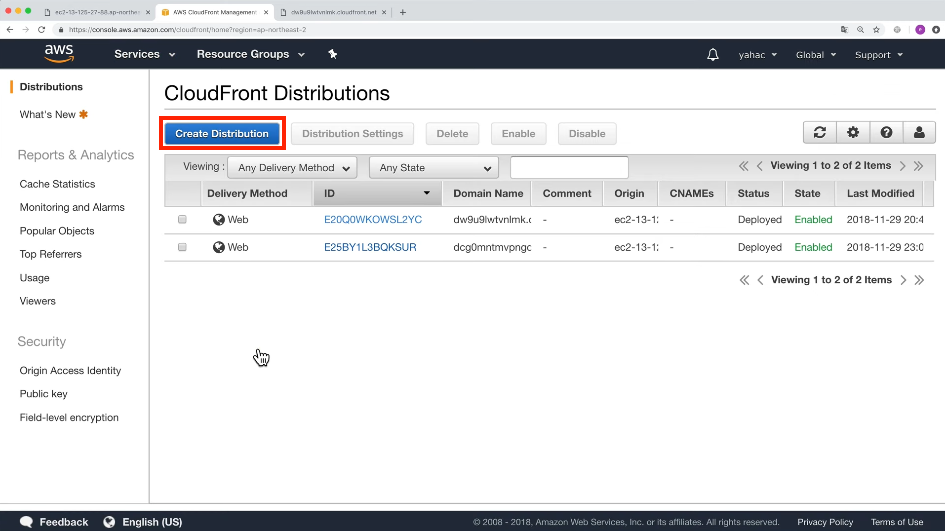
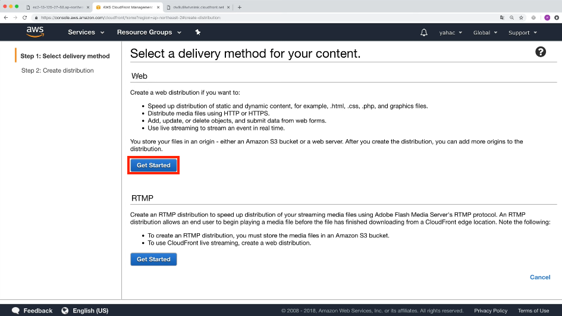
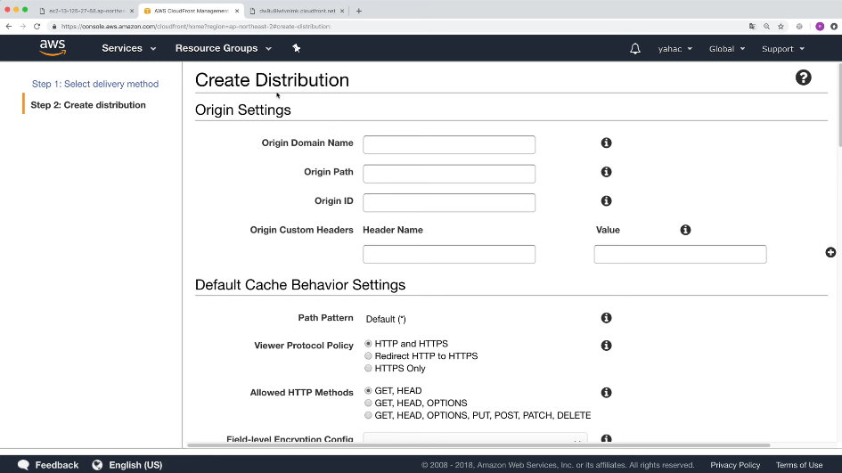
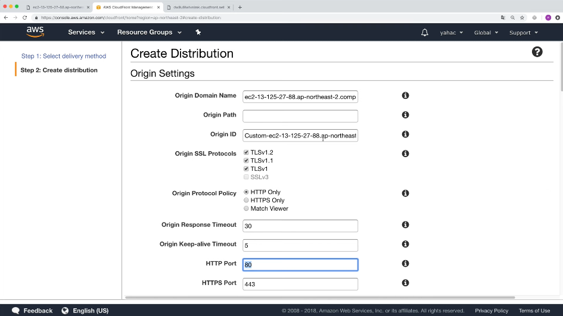
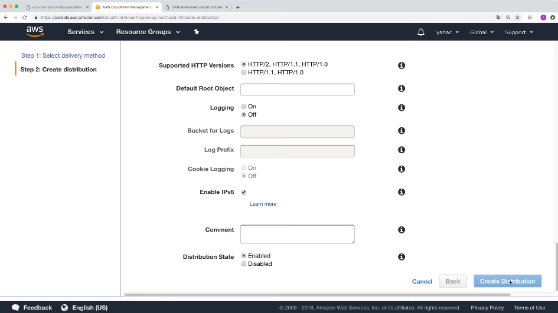
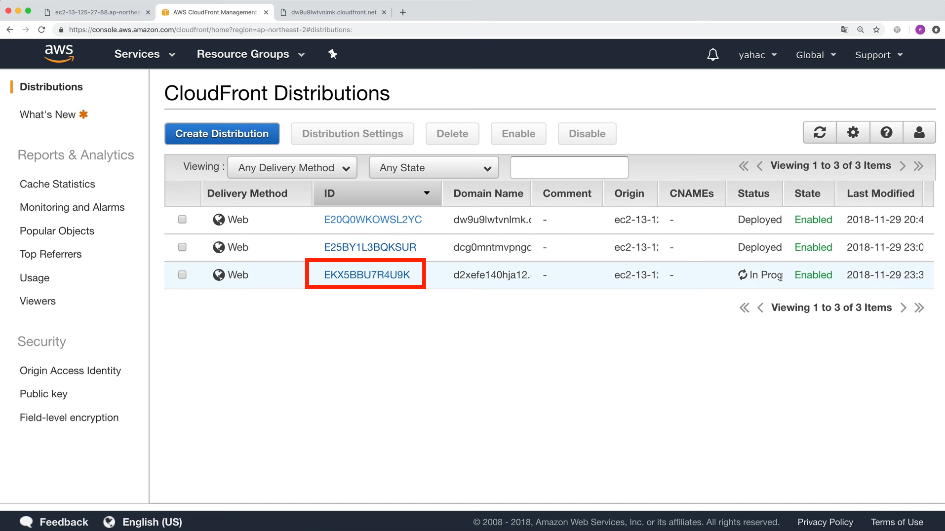
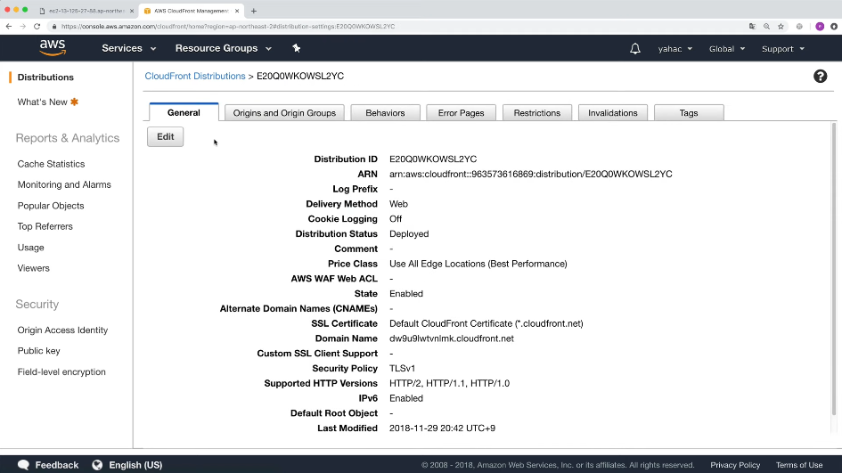
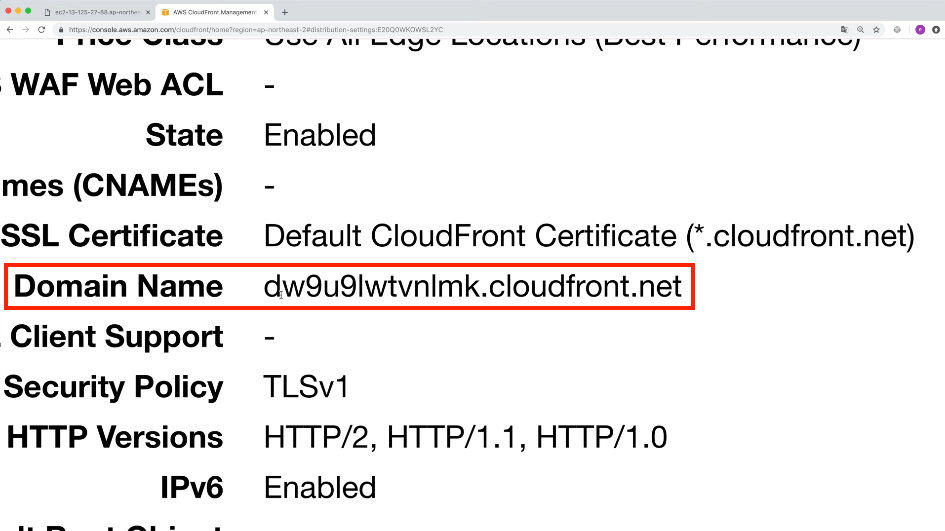
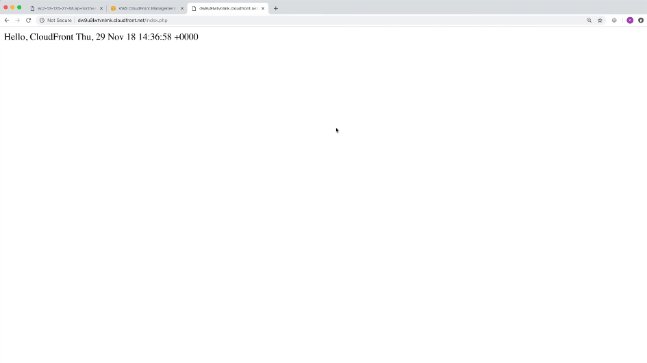
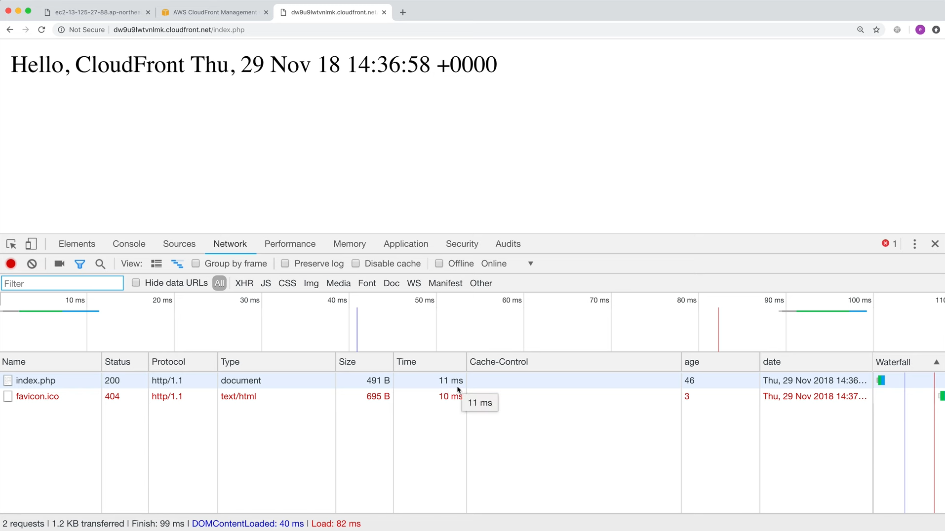

# Cloud Front 1

## Cloud Front란?

CloudFront는 아마존 웹 서비스(Amazon Web Services, AWS)에서 제공하는 콘텐츠 전송 네트워크 서비스입니다. 이 서비스는 정적 및 동적 웹 콘텐츠, 비디오 스트림, 애플리케이션 데이터 등을 사용자에게 더 빠르고 안정적으로 제공하는 역할을 합니다. CloudFront는 전 세계에 위치한 엣지 서버를 활용하여 콘텐츠를 캐시하고, 사용자가 가장 가까운 엣지 서버에서 콘텐츠를 로드하도록 도와주며, 이를 통해 응답 시간을 최소화합니다. 또한 CloudFront는 DDoS 공격 방어와 보안 기능을 제공하여 웹 애플리케이션을 안전하게 유지하는 역할도 수행합니다.

### Cache

사용자의 요청 마다 웹페이지가 변경되어야 한다면. 한번 요청했을때 저장해 뒀다가 그다음 부터는 저장된 결과를 보여주는 것을 cache라고 합니다.

### CDN(Content Delivery Network)

전세계의 유저들이 사용하는 웹환경에 접속하는데 접속 지연시간을 극복 하기 위해 사용하는 기술 입니다 

-> CloudFront는 기본적으로 Cache server입니다. 하지만 전 세계에 구성되어있는 AWS 설비때문에 CDN으로 동작하기도 합니다.

## 시작하기

클라우드 프론트를 사용하게 되면 앞으로 클라우드 프론트가 클라이언트가 되서 웹서버에 요청하게 된다.
웹서버가 클라우드프론트에게 보내주면 그 정보를 저장해두고 사용자에게 보내주게 된다.

웹서버는 origin으로 부르게 된다
클라이언트는 distribution 으로 부르게 된다.

origin: AWS를 사용하면 클릭해서 목록에서 선택해주고 개인 서버를 사용할시에 파일이름, http는 뻬준다.
HTTP Port: origin의 포트를 적는다 

Distribution은 넘긴다 

