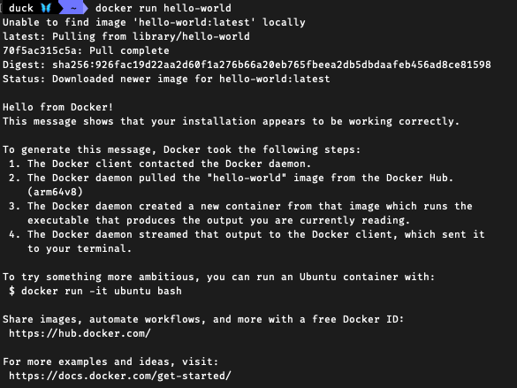

# DOCKER_1(Front-end )

## WHY

### 어떠한 프로그램을 다운 받는 과정을 간단하게 만들기 위해서 입니다.

-   정상적인 프로그램 설치 과정 
    인스톨러 내려받기 -> 인스톨러 실행 -> 프로그램 설치 완료

-   다른 환경의 프로그램 설치 과정 
    인스톨러 내려받기 -> 인스톨러 실행 -> 에러 

-->가지고 있는 서버, 패키지 버전, 운영체제 등에 따라 프로그램 설치과정이 틀려지며 중간 단계가 요구되고 많이 복잡해 질 수 있습니다.

## WHAT

컨테이너를 사용하여 응용프로그램을 더 쉽게 만들고 배포하고 실행할 수 있도록 설계한 도구 이며 컨테이너 기반의 오픈소스 가상화 플랫폼입니다.

컨테이너 안에 다양한 프로그램, 실행환경을 컨테이너로 추상화하고 동일한 인터페이스를 제공하여 프로그램의 배포 및 관리를 단순하게 하여
AWS Azure Google cloud등 어디서든 사용할 수 있게 해줍니다.

## INSTALL

### WINDOW

1. docker.com/get-started
2. 버전에 맞게 설치
3. WSL error 해결 
4. 실행

### MAC

1. docker.com/get-started
2. 버전에 맞게 설치
3. 도커를 애플리케이션으로 설치

## START

### hello world 실행해 보기

1. 터미널 열기
2. docker run hello-world 입력
3. 실행 완료
   

##### 설명

1. 도커 클라이언트에 커맨드를 입력하면 클라이언트에서 도커 서버로 요청 보냄
2. 서버에서 hello-world라는 이미지가 로컬에 cache되어있는지 확인
3. 초기에는 없어서 Unable to find image 라는 문가표시 출력
4. Docker Hub에서 hello-world 이미지를 가져오고 로컬에 보관
5. 컨테이너 생성
6. 프로그램 실행

### 이미지 생성하기

hello-world 이미지는 hub에서 만들어진 이미지를 가져온 것입니다.
이번에는 직접 이미지를 생성해 보도록 하겠습니다.

#### 순서

1. 도커파일 작성 : 도커 파일이란 도커 이미지를 만들기 위한 설정 파일입니다. 컨테이너가 어떻게 행동 해야하는지에 대한 설정을 정의 합니다.

2. 도커 클라이언트 : 도커 파일에 입력된 명령들이 도커 클라이언트에 전달 되어야 합니다.

3. 도커 서버 : 도커 클라이언트에 전달된 모든 중요한 작업을 진행합니다.

4. 이미지 생성
