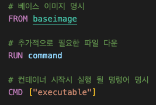
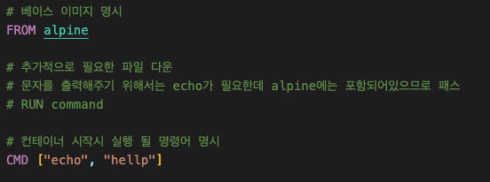
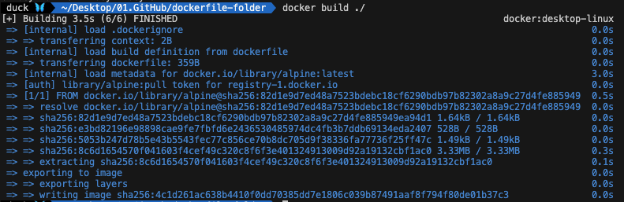
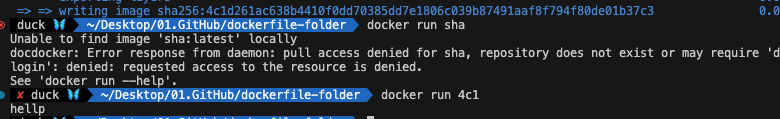

# DOCKER_1(Front-end )

## HOW

### 이미지 생성하기

hello-world 이미지는 hub에서 만들어진 이미지를 가져온 것입니다.
이번에는 직접 이미지를 생성해 보도록 하겠습니다.

#### 순서

1. 도커파일 작성 : 도커 파일이란 도커 이미지를 만들기 위한 설정 파일입니다. 컨테이너가 어떻게 행동 해야하는지에 대한 설정을 정의 합니다.

<hr>

-   도커파일 이란?

1. 베이스 이미지를 명시해 준다.(파일 스냅샷에 해당)
2. 추가적으로 필요한 파일을 다운 받기 위한 몇 가지 명령어를 명시해 준다
3. 컨테이너 시작 시 실행될 명령어를 명시해 준다.

-   베이스 이미지란
    도커 이미지는 여러개의 레이어들로 되어 있습니다.
    그 중에서 베이스 이미지는 이 이미지의 기반이 되는 부분입니다.

레이어는 중간 단계의 이미지라고 생각하면 됩니다.
| |
|:--:|
|layer|
|layer|
|baseImage|

위와 같은 형태로 구성되며
베이스 이미지는 OS라고 생각하면 됩니다.(window, mac, linux)

<hr>

2. 도커 클라이언트 : 도커 파일에 입력된 명령들이 도커 클라이언트에 전달 되어야 합니다.

3. 도커 서버 : 도커 클라이언트에 전달된 모든 중요한 작업을 진행합니다.

4. 이미지 생성

## DO

### 1. 도커파일 생성

1. docker folder 생성
2. 파일생성 dockerfile
3. 기본 내용 명시
   
4. 작성
   

### 2. 도커 클라이언트 ~ 4 이미지 생성

도커 데스크탑이 켜져 있는 사앹에서 진행한다.

```bash
docker build ./
```



### 이미지 실행


마지막 writing image의 sha256의 앞 몇 자리만 입력해도 실행 됩니다.
