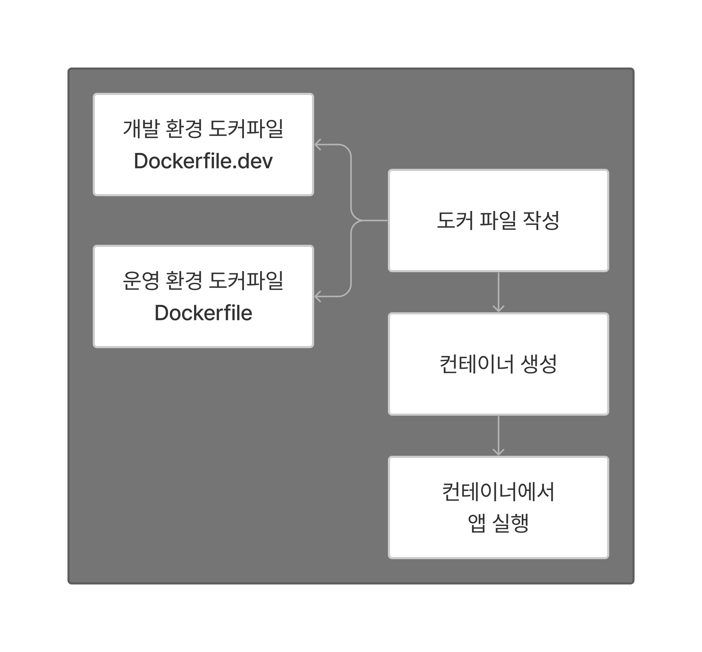
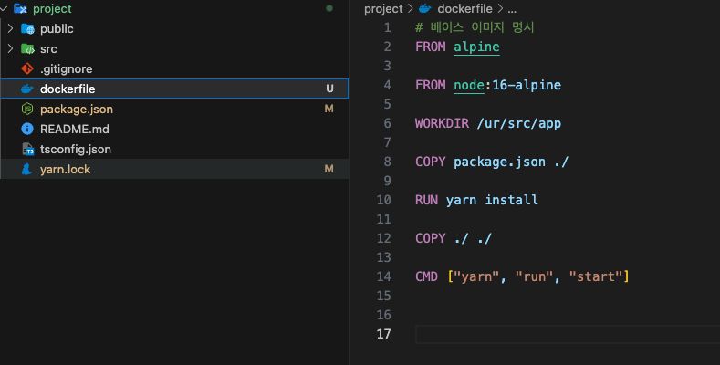
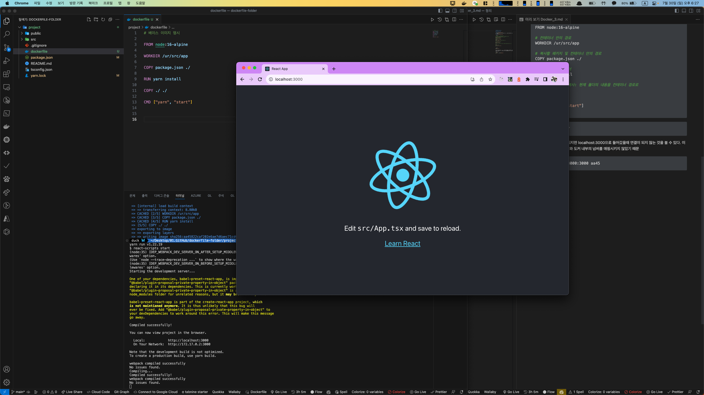

# DOCKER_1(Front-end )

## Docker React App


셀제로는 두개의 파일을 만들어줘야 하지만 dockerfile하나로 통합해서 사용하도록 하겠습니다.


```bash
# 베이스 이미지 node:16-alpine
# alpine은 굉장히 용량이 작은 베이스이기 때문에
# node16버전안의 alpine을 이용한다
FROM node:16-alpine

# 컨테이너 안의 경로
WORKDIR /ur/src/app

# 복사할 패키지 및 컨테이너 안의 경로
COPY package.json ./

# 종속성 설치 명령어
RUN yarn install

# 리액트 구성요소 복사: 현제 폴더의 내용을 컨테이너 경로로
COPY ./ ./

# 실행 명령어
CMD ["yarn", "start"]
```

```bash
docker build ./
```

이렇게 실행하면 실행은 되지만 localhost:3000으로 들어갔을때 연결이 되지 않는 것을 볼 수 있다. 이유는 도커외부의 로컬넘버와 도커 내부의 넘버를 매핑시키지 않았기 때문

```bash
docker run -p 3000:3000 aa45
```



정상적으로 배포하여 실행되는 것을 볼 수 있습니다.
